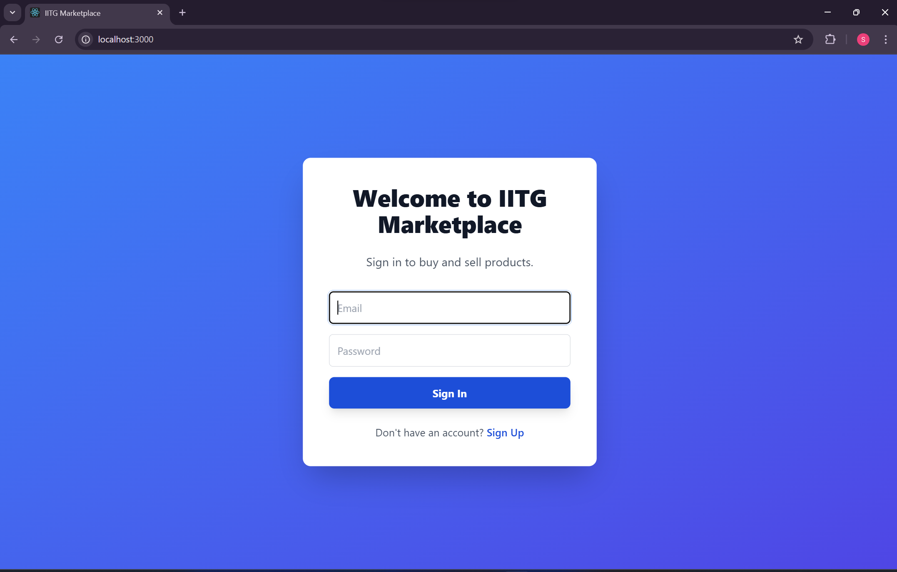
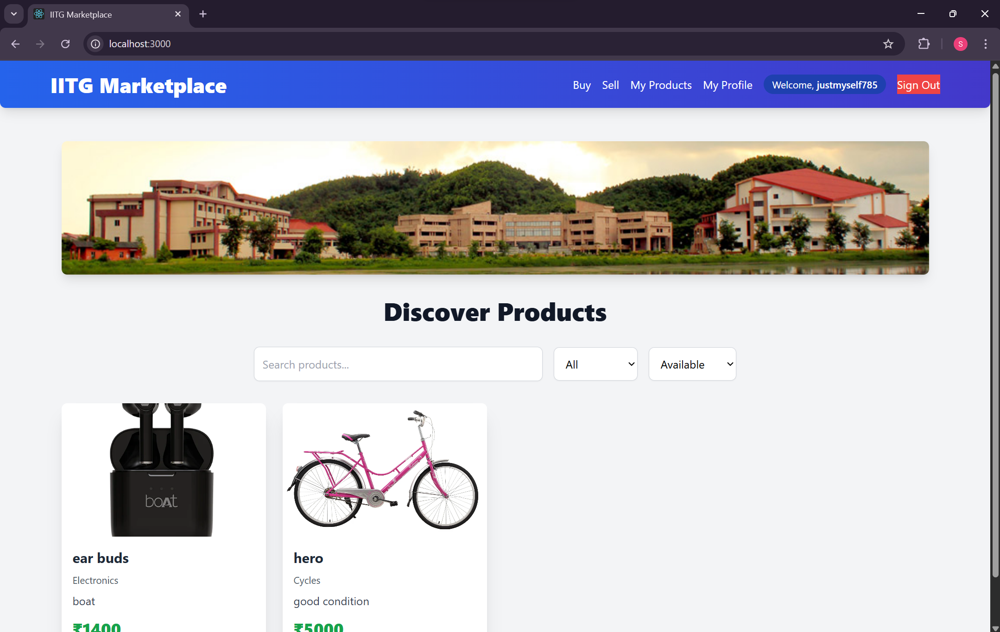
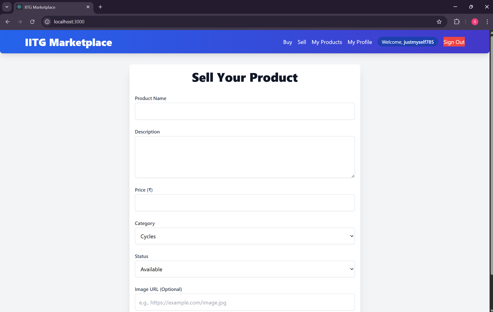

# 🛍️ OLX IITG - IITG Marketplace

**OLX IITG** is a buy-and-sell platform exclusively for IIT Guwahati students. It allows users to list products, explore available items, and manage their listings with a clean and intuitive interface.

---

## 🚀 Features

- 🧾 Post product ads with title, description, category, price, and image
- 🔍 Browse and filter listings by category and availability
- 👤 View your posted items in a dashboard
- 🔐 Email/password authentication with Firebase
- 🎨 Clean and responsive UI (Tailwind + Material UI)

---
## 📸 Screenshots

### 🔐 Sign In Page


---

### 🏠 Home Page


---

### 📝 Sell Product Page


---

## 🛠️ Tech Stack

- **Frontend**: React.js  
- **Styling**: Tailwind CSS, Material UI  
- **Routing**: React Router  
- **Authentication**: Firebase Auth (Email/Password)  
- **Storage**: Firebase Firestore *(to be integrated)*  

---

## 📁 Folder Structure
```bash
olx-iitg/
├── public/
│ └── index.html
├── src/
│ ├── components/
│ │ ├── Auth/
│ │ │ ├── LoginScreen.js
│ │ │ └── SignupScreen.js
│ │ ├── ProductCard.js
│ │ ├── ProductList.js
│ │ ├── Header.js
│ │ ├── MyProducts.js
│ │ └── DeleteConfirmationModal.js
│ ├── pages/
│ │ ├── SellProductForm.js
│ │ ├── ProductDetailPage.js
│ │ └── ProfileScreen.js
│ ├── firebase/
│ │ └── FirebaseContext.js
│ ├── App.js
│ ├── index.js
│ └── index.css
├── screenshots/
│ ├── signin.png
│ ├── home.png
│ └── sellpage.png
├── .env
├── .gitignore
├── README.md
├── package.json
└── package-lock.json
````


---

## 📦 Installation

To run the project locally:

```bash
git clone https://github.com/your-username/olx-iitg.git
cd olx-iitg
npm install
npm start
